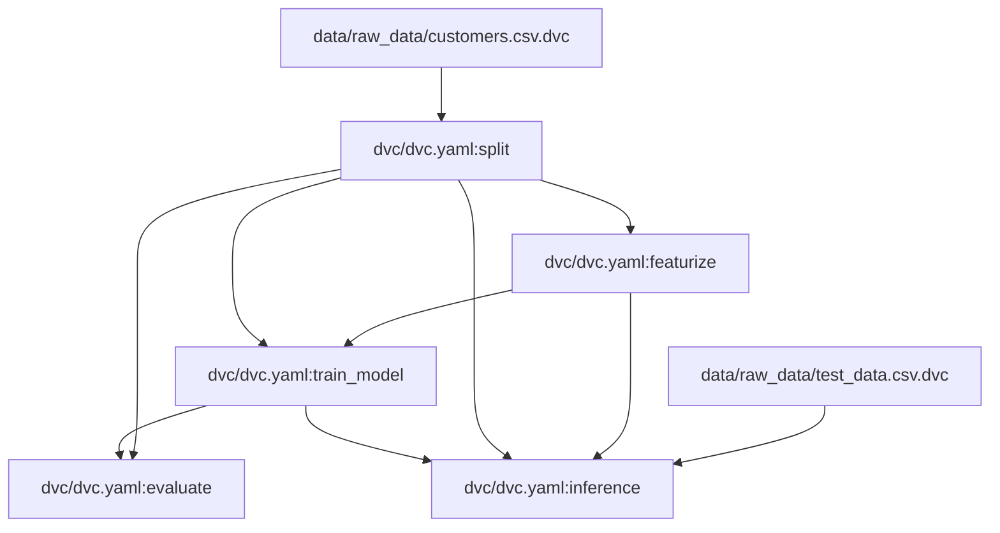

# Project name

Project description

## Project initialisation steps:

1. Initialize virtual environment.
2. Install uv with conda
    ```
    conda install -y poetry
    ```
    or with pip
    ```
    pip install poetry
    ```

3. Install dependencies with poetry
    ```
    poetry install
    ```

## DVC Pipeline
<!-- DVC DAG START -->

<!-- DVC DAG END -->
